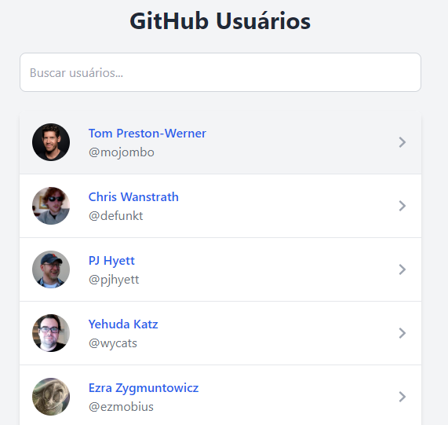
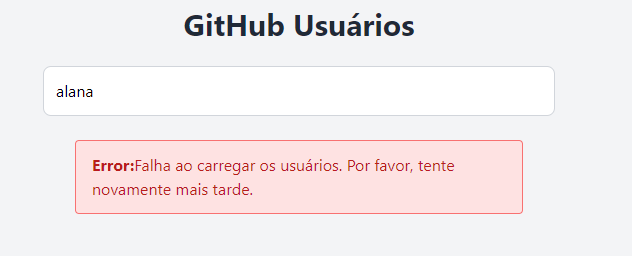
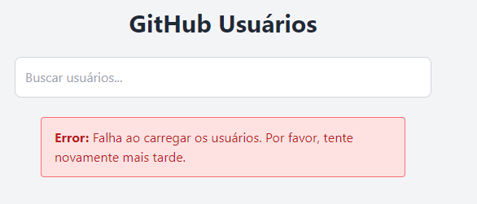
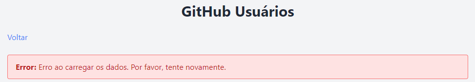

# Projeto de Usuários

Este projeto é uma aplicação Next.js que exibe uma lista de usuários e detalhes sobre eles. A seguir, estão detalhadas as estratégias de carregamento de dados e funcionalidades adicionais implementadas.

# Guia para Gerar um Token de Acesso Pessoal do GitHub

Este guia explica como criar um token de acesso pessoal do GitHub neste aplicativo.

## Passos para Gerar um Token do GitHub

1. **Acesse sua Conta GitHub**
   - Vá para [GitHub](https://github.com) e faça login na sua conta.

2. **Acesse as Configurações**
   - Clique na sua foto de perfil no canto superior direito da página e selecione **"Settings"** (Configurações).

3. **Navegue para Configurações de Desenvolvedor**
   - No menu lateral esquerdo, role para baixo e clique em **"Developer settings"** (Configurações de desenvolvedor).

4. **Crie um Novo Token**
   - Clique em **"Tokens (classic)"**.
   - Em seguida, clique em **"Generate new token"** (Gerar novo token).

5. **Configure o Token**
   - **Note**: Dê um nome ao seu token, como **"Github-users Token"** para ajudar a identificar seu uso.
   - Defina a **data de expiração** do token conforme sua necessidade (opcional).
   - **Scopes**: Selecione as permissões **"repo"** e **"user"**. 
   - Clique em **"Generate token"** (Gerar token).

6. **Copie o Token**
   - O GitHub exibirá o token gerado. **Copie-o imediatamente**, pois você não poderá vê-lo novamente após sair dessa página.
   - **Nota:** Armazene o token em um local seguro. Não compartilhe seu token publicamente.

7. **Configure o Token no Seu Aplicativo**
   - Atualize a variável TOKEN no arquivo .env

## Dicas de Segurança

- **Não compartilhe seu token**: O token de acesso é como uma senha e deve ser tratado com o mesmo nível de segurança.
- **Revogue tokens não usados**: Se você gerar um novo token ou não precisar mais de um token antigo, lembre-se de revogá-lo nas configurações do GitHub.
- **Armazene tokens com segurança**: Use mecanismos seguros para armazenar tokens, como variáveis de ambiente ou serviços de gerenciamento de segredos.

## Tecnologias Utilizadas

### Next.js

- **Descrição**: Framework React para aplicações de renderização do lado do servidor e geração de sites estáticos. Utilizado para criar a estrutura do projeto e gerenciar a renderização de páginas.
- **Objetivo**: Fornece uma solução robusta para o roteamento e a renderização de páginas, tanto estaticamente (`getStaticProps`) quanto dinamicamente (`getServerSideProps`).

### Tailwind CSS

- **Descrição**: Framework de CSS utilitário que permite criar interfaces modernas e responsivas rapidamente.
- **Objetivo**: Facilita a estilização de componentes e layouts, promovendo um design consistente e reduzindo a necessidade de escrever CSS customizado. Utilizado para estilizar a interface do usuário e garantir um design responsivo e atraente.

### Redux

- **Descrição**: Biblioteca para gerenciamento de estado previsível em aplicações JavaScript.
- **Objetivo**: Utilizado para controlar o estado global da aplicação, como o registro de usuários visitados e gostados. Facilita a gestão de estados complexos e a sincronização entre componentes.

## Visualizando o Estado do Redux com Redux DevTools

Para depurar e inspecionar o estado do Redux em sua aplicação, você pode usar o [Redux DevTools](https://github.com/reduxjs/redux-devtools). Siga os passos abaixo para instalar a extensão do navegador apropriada.

### 1. Instalar o Redux DevTools

#### **Para Google Chrome**

1. Abra o [Google Chrome](https://www.google.com/chrome/).
2. Acesse a [Chrome Web Store](https://chromewebstore.google.com/detail/redux-devtools/lmhkpmbekcpmknklioeibfkpmmfibljd?hl=pt-pt).
3. Pesquise por "Redux DevTools".
4. Clique em **"Adicionar ao Chrome"**.
5. Confirme a instalação clicando em **"Adicionar extensão"**.

## Lighthouse

### Descrição

**Lighthouse** é uma biblioteca e ferramenta de código aberto para auditar a qualidade de páginas web. Desenvolvida pelo Google, ela permite avaliar o desempenho, acessibilidade, práticas recomendadas e SEO de uma página, ajudando a identificar áreas de melhoria e garantindo uma melhor experiência para os usuários.

### Objetivo

O objetivo do Lighthouse é fornecer uma análise detalhada da página web, destacando pontos fortes e fracos em aspectos cruciais como:

- **Desempenho**: Medidas de quão rapidamente a página carrega e se torna interativa.
- **Acessibilidade**: Avaliação de como a página atende às necessidades de usuários com deficiências.
- **Práticas Recomendadas**: Verificação de práticas recomendadas para segurança e estabilidade.
- **SEO**: Análise de como a página está otimizada para motores de busca.

Lighthouse ajuda a garantir que sua página web não apenas funcione bem, mas também ofereça uma experiência de usuário de alta qualidade.

### Como Usar

#### No Google Chrome DevTools

1. Abra o Google Chrome.
2. Navegue até a página que deseja auditar.
3. Abra o DevTools (`F12` ou `Ctrl+Shift+I` no Windows/Linux, `Cmd+Option+I` no macOS).
4. Vá para a aba **"Lighthouse"**.
5. Escolha as opções desejadas para a auditoria (por exemplo, Performance, Accessibility, SEO, etc.).
6. Clique em **"Generate report"**.

#### Linha de Comando

1. Instale o Lighthouse globalmente usando npm:

```bash
npm install -g lighthouse
```

2. Execute o Lighthouse para Desktop

```bash
lighthouse http://localhost:3000/ --output html --output-path ./report-desktop.html --config-path ./lighthouse-config-desktop.json
```

3. Execute o Lighthouse para Mobile

```bash
lighthouse http://localhost:3000/ --output html --output-path ./report-mobile.html --config-path ./lighthouse-config-mobile.json
```

OBS: não passei muito tempo nessa parte, então daria sim pra otimizar melhor a app.

## Como Rodar o Projeto

Instale as dependências do projeto:

1. ** Install **
```bash
npm install
```

Inicie o servidor de desenvolvimento. Isso irá rodar a aplicação em modo de desenvolvimento e você poderá acessá-la em http://localhost:3000:

2. ** Rodar o Servidor de Desenvolvimento **
```bash
npm run dev

```

Para criar uma versão de produção do projeto, execute o comando de build:

3. ** Construir o Projeto **
```bash
npm run build

```

Após o build, inicie o servidor de produção:

4. ** Iniciar o Servidor de Produção **
```bash
npm run start

```

Para verificar o código com ESLint, execute:

5. ** Executar Lint **
```bash
npm run lint

```

## Como Rodar os testes


5. ** Instalar para e2e **
```bash
npx playwright install

```
```bash
npm run test:e2e

```

## Telas e documentação
### Página inicial
Buscando usuário na api.



Lista de usuários marcando usuário que já foram visitados.


Erro ao buscar os usuários na api quando faz a busca pelo campo.



Erro ao buscar os usuários na api.



### Detalhes do usuário
Buscando informações básicas do usuário e seus repositórios.


Erro ao buscar detalhes do usuário na api.



## Estratégias de Carregamento de Dados

### Página Inicial `/users` com Busca `/search/users`

- **Descrição**: Exibe uma lista de todos os usuários e permite ao usuário buscar por usuários Github.
- **Estratégia de Dados**: 
  - Utiliza renderização no client para obter dados dinamicamente com base na interação do usuário com a busca.
  - Utiliza **`getServerSideProps`** para obter dados no primeiro carregamento da aplicação.

### Página de Detalhes do Usuário `/users/username` e Listagem de Repositórios `/users/username/repos`

- **Descrição**: Mostra detalhes específicos de um usuário e seus repositórias.
- **Estratégia de Dados**: 
  - Utiliza **`getStaticProps`** para gerar a página estaticamente. Dados não mudam frequentemente, o que justifica o uso de renderização estática.

## Funcionalidades Extras

### Controle de Visitas de Usuários

- **Descrição**: Permite que os usuários saibam quais perfis eles já visitaram anteriormente.
- **Implementação**: Utiliza Redux para gerenciar o estado da aplicação, incluindo:
  - **Usuários Visitados**: Mantém um registro dos usuários visualizados.
  - **Usuários Gostados**: Funcionalidade planejada para implementação futura, permitindo que os usuários marquem perfis que gostaram. (implementar futuramente)

## Referências

- [OhMyCrawl: `getStaticProps` vs `getServerSideProps`](https://www.ohmycrawl.com/nextjs/getstaticprops-vs-getserversideprops/)
- [Dev.to: Next.js Data Fetching - `getStaticProps` vs `getServerSideProps`](https://dev.to/mikevarenek/nextjs-data-fetching-getstaticprops-vs-getserversideprops-39ia)

