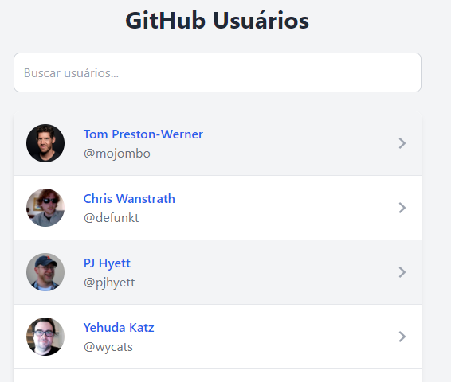
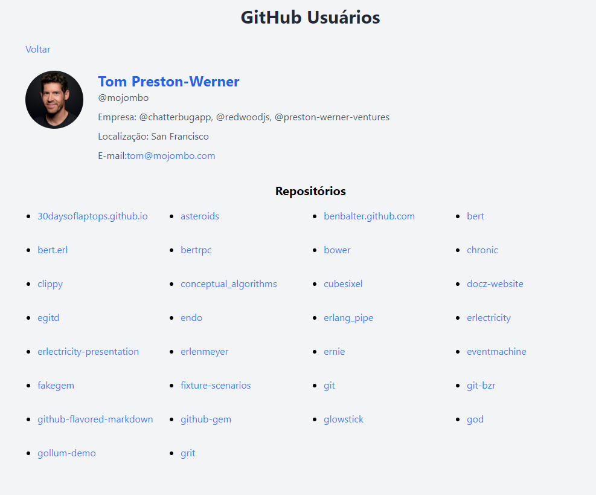
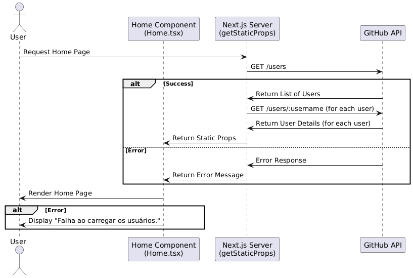
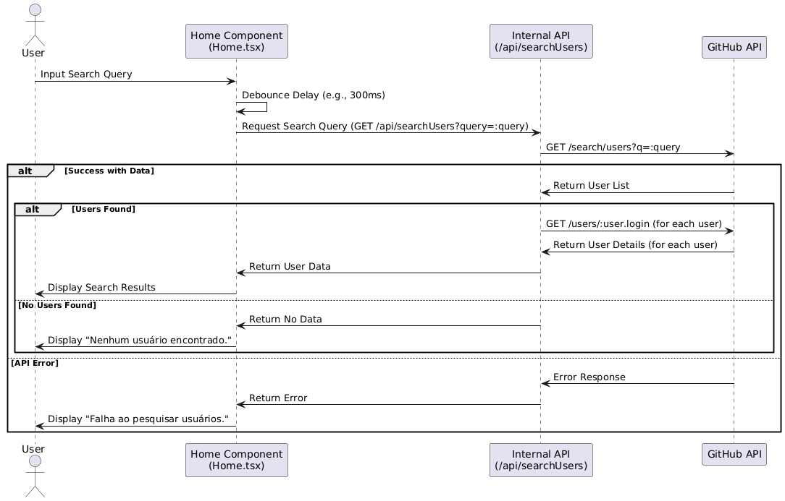
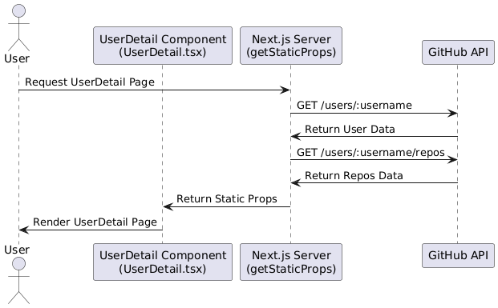
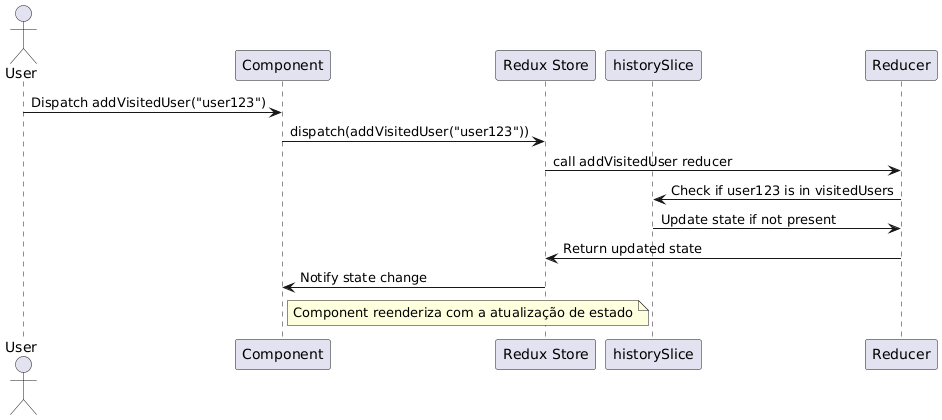
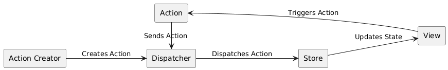

# Projeto de Usuários

Este projeto é uma aplicação Next.js que exibe uma lista de usuários e detalhes sobre eles. A seguir, estão detalhadas as estratégias de carregamento de dados e funcionalidades adicionais implementadas.

## Guia para Gerar um Token de Acesso Pessoal do GitHub

Este guia explica como criar um token de acesso pessoal do GitHub para este aplicativo.

### Passos para Gerar um Token do GitHub

1. **Acesse sua Conta GitHub**
   - Vá para [GitHub](https://github.com) e faça login na sua conta.

2. **Acesse as Configurações**
   - Clique na sua foto de perfil no canto superior direito da página e selecione **"Settings"** (Configurações).

3. **Navegue para Configurações de Desenvolvedor**
   - No menu lateral esquerdo, role para baixo e clique em **"Developer settings"** (Configurações de desenvolvedor).

4. **Crie um Novo Token**
   - Clique em **"Tokens (classic)"**.
   - Em seguida, clique em **"Generate new token"** (Gerar novo token).

5. **Configure o Token**
   - **Note**: Dê um nome ao seu token, como **"Github-users Token"** para ajudar a identificar seu uso.
   - Defina a **data de expiração** do token conforme sua necessidade (opcional).
   - **Scopes**: Selecione as permissões **"repo"** e **"user"**.
   - Clique em **"Generate token"** (Gerar token).

6. **Copie o Token**
   - O GitHub exibirá o token gerado. **Copie-o imediatamente**, pois você não poderá vê-lo novamente após sair dessa página.
   - **Nota:** Armazene o token em um local seguro. Não compartilhe seu token publicamente.

7. **Configure o Token no Seu Aplicativo**
   - Atualize a variável `TOKEN` no arquivo `.env`.

### Dicas de Segurança

- **Não compartilhe seu token**: O token de acesso é como uma senha e deve ser tratado com o mesmo nível de segurança.
- **Revogue tokens não usados**: Se você gerar um novo token ou não precisar mais de um token antigo, lembre-se de revogá-lo nas configurações do GitHub.
- **Armazene tokens com segurança**: Use mecanismos seguros para armazenar tokens, como variáveis de ambiente ou serviços de gerenciamento de segredos.

## Tecnologias Utilizadas

### Next.js

- **Descrição**: Framework React para aplicações de renderização do lado do servidor e geração de sites estáticos. Utilizado para criar a estrutura do projeto e gerenciar a renderização de páginas.
- **Objetivo**: Fornece uma solução robusta para o roteamento e a renderização de páginas, tanto estaticamente (`getStaticProps`) quanto dinamicamente (`getServerSideProps`).

### Jest

- **Descrição**: Jest é um framework de testes para JavaScript. Suporta testes unitários, de integração e de snapshots. Fornece uma API rica para criar e executar testes, além de recursos como cobertura de código e execução paralela de testes para melhorar o desempenho.
- **Objetivo**: Facilitar a escrita e execução de testes em código JavaScript/TypeScript.

### Playwright

- **Descrição**: Playwright é uma ferramenta para automação de navegador desenvolvida pela Microsoft. É usada para testes end-to-end (E2E) e suporta múltiplos navegadores, incluindo Chromium, Firefox e WebKit.
- **Objetivo**: Ideal para testes que envolvem a interação com a interface do usuário e a validação do comportamento da aplicação de ponta a ponta.

### Tailwind CSS

- **Descrição**: Framework de CSS utilitário que permite criar interfaces modernas e responsivas rapidamente.
- **Objetivo**: Facilita a estilização de componentes e layouts, promovendo um design consistente e reduzindo a necessidade de escrever CSS customizado. Utilizado para estilizar a interface do usuário e garantir um design responsivo e atraente.

### Redux

- **Descrição**: Biblioteca para gerenciamento de estado previsível em aplicações JavaScript.
- **Objetivo**: Controlar o estado global da aplicação, como o registro de usuários visitados e gostados. Facilita a gestão de estados complexos e a sincronização entre componentes.

#### Visualizando o Estado do Redux com Redux DevTools

Para depurar e inspecionar o estado do Redux em sua aplicação, você pode usar o [Redux DevTools](https://github.com/reduxjs/redux-devtools). Siga os passos abaixo para instalar a extensão do navegador apropriada.

##### 1. Instalar o Redux DevTools

###### **Para Google Chrome**

1. Abra o [Google Chrome](https://www.google.com/chrome/).
2. Acesse a [Chrome Web Store](https://chromewebstore.google.com/detail/redux-devtools/lmhkpmbekcpmknklioeibfkpmmfibljd?hl=pt-pt).
3. Pesquise por "Redux DevTools".
4. Clique em **"Adicionar ao Chrome"**.
5. Confirme a instalação clicando em **"Adicionar extensão"**.

### Lighthouse

- **Descrição**: Lighthouse é uma biblioteca e ferramenta de código aberto para auditar a qualidade de páginas web. Desenvolvida pelo Google, permite avaliar o desempenho, acessibilidade, práticas recomendadas e SEO de uma página, ajudando a identificar áreas de melhoria e garantindo uma melhor experiência para os usuários.
- **Objetivo**: Fornecer uma análise detalhada da página web, destacando pontos fortes e fracos em aspectos cruciais como desempenho, acessibilidade, práticas recomendadas e SEO.

#### Como Usar

##### No Google Chrome DevTools

1. Abra o Google Chrome.
2. Navegue até a página que deseja auditar.
3. Abra o DevTools (`F12` ou `Ctrl+Shift+I` no Windows/Linux, `Cmd+Option+I` no macOS).
4. Vá para a aba **"Lighthouse"**.
5. Escolha as opções desejadas para a auditoria (por exemplo, Performance, Accessibility, SEO, etc.).
6. Clique em **"Generate report"**.

##### Linha de Comando

1. Instale o Lighthouse globalmente usando npm:

    ```bash
    npm install -g lighthouse
    ```

2. Com a app rodando em produção, execute o Lighthouse para Desktop:

    ```bash
    lighthouse http://localhost:3000/ --output html --output-path ./report-desktop.html --config-path ./lighthouse-config-desktop.json
    ```

3. Execute o Lighthouse para Mobile:

    ```bash
    lighthouse http://localhost:3000/ --output html --output-path ./report-mobile.html --config-path ./lighthouse-config-mobile.json
    ```

**OBS**: Não passei muito tempo nessa parte, então daria para otimizar melhor a app.

## Como Rodar o Projeto

1. **Instalar Dependências**

    ```bash
    npm install
    ```

2. **Rodar o Servidor de Desenvolvimento**

    ```bash
    npm run dev
    ```

    Isso irá rodar a aplicação em modo de desenvolvimento e você poderá acessá-la em [http://localhost:3000](http://localhost:3000).

3. **Construir o Projeto**

    ```bash
    npm run build
    ```

4. **Iniciar o Servidor de Produção**

    ```bash
    npm run start
    ```

5. **Executar Lint**

    ```bash
    npm run lint
    ```

## Como Rodar os Testes

1. **Testes E2E**

    A instalação do Playwright inclui a configuração de ferramentas essenciais e a instalação dos navegadores necessários para os testes.

    ```bash
    npx playwright install
    ```

    Execute os testes E2E:

    ```bash
    npm run test:e2e
    ```

2. **Testes de Integração e Unitários**

    ```bash
    npm run test
    ```

## Telas e Documentação

### Página Inicial

- Buscando usuário na API.

    

- Lista de usuários marcando usuários que já foram visitados.

    

- Erro ao buscar os usuários na API quando faz a busca pelo campo.

    

- Erro ao buscar os usuários na API.

    

### Detalhes do Usuário

- Buscando informações básicas do usuário e seus repositórios.

    

- Erro ao buscar detalhes do usuário na API.

    

## Diagramas de Sequência

### Fluxo de Solicitação da Página Inicial



#### Fluxo de Ações

1. **Usuário Solicita Página Inicial**
   - O usuário faz uma solicitação para a página inicial (Home).

2. **Servidor Obtém Lista de Usuários**
   - O servidor Next.js processa essa solicitação chamando a API do GitHub para obter uma lista de usuários (`GET /users`).

3. **API do GitHub Retorna Lista de Usuários**
   - A API do GitHub responde com a lista de usuários.

4. **Servidor Obtém Detalhes Adicionais dos Usuários**
   - Para cada usuário na lista, o servidor faz uma solicitação adicional à API do GitHub para obter detalhes específicos sobre cada usuário (`GET /users/:username`).

5. **API do GitHub Retorna Detalhes dos Usuários**
   - A API do GitHub responde com os detalhes adicionais de cada usuário, como o nome completo.

6. **Servidor Retorna Props Estáticas**
   - O servidor prepara os dados agregados (lista de usuários com detalhes adicionais) e os envia como props estáticas para o componente Home.

7. **Home Renderiza a Página Inicial**
   - O componente Home usa as props estáticas para renderizar a página inicial para o usuário.

### Fluxo de Pesquisa de Usuário



#### Fluxo de Ações

1. **Usuário (User)**
   - O usuário digita uma consulta de pesquisa na interface do componente Home.

2. **Componente Home (Home)**
   - O componente Home aciona a função `debouncedSearch` quando o usuário digita.
   - A função `debouncedSearch` introduz um atraso (debounce) para evitar chamadas excessivas enquanto o usuário ainda está digitando. Este atraso é representado no diagrama como "Debounce Delay" (por exemplo, 300ms).

3. **API Interna (InternalAPI)**
   - Após o atraso do debounce, a função `debouncedSearch` faz uma solicitação GET para a API interna com a consulta (`/api/searchUsers?query=:query`).

4. **API Interna (InternalAPI)**
   - A API interna processa a solicitação e faz uma chamada à API externa (GitHub) para obter os dados dos usuários.

5. **API Externa (GitHubAPI)**
   - A API do GitHub responde com os dados dos usuários que correspondem à consulta.

6. **API Interna (InternalAPI)**
   - Recebe os dados da API externa e retorna esses dados para o componente Home.

7. **Componente Home (Home)**
   - Atualiza a interface com os resultados da pesquisa.

### Fluxo de Dados para a Página de Detalhes do Usuário



#### Fluxo de Ações

1. **Usuário Solicita Página de Detalhes do Usuário**
   - O usuário faz uma solicitação para ver a página de detalhes do usuário.

2. **Servidor Obtém Dados do Usuário**
   - O servidor Next.js processa essa solicitação chamando a API do GitHub para obter informações sobre o usuário (`GET /users/:username`).

3. **API do GitHub Retorna Dados do Usuário**
   - A API do GitHub responde com os dados do usuário.

4. **Servidor Obtém Dados dos Repositórios**
   - O servidor então solicita os repositórios do usuário à API do GitHub (`GET /users/:username/repos`).

5. **API do GitHub Retorna Dados dos Repositórios**
   - A API do GitHub responde com os dados dos repositórios.

6. **Servidor Retorna Props Estáticas**
   - O servidor envia os dados obtidos (tanto os dados do usuário quanto dos repositórios) como props estáticas para o componente `UserDetail`.

7. **UserDetail Renderiza a Página**
   - O componente `UserDetail` usa as props estáticas para renderizar a página de detalhes do usuário para o usuário.

### Fluxo De Dados para Store


#### Fluxo de Ações

O fluxo do Redux para o slice `historySlice` envolve o seguinte processo:

1. **User**: 
   - O usuário (ou componente) despacha a ação `addVisitedUser` com o payload `"user123"`.

2. **Component**:
   -  O componente (ou qualquer outro lugar onde a ação é despachada) envia a ação para o `Redux Store`.

3. **Store**:
   -  O Redux Store recebe a ação e a envia para o `Reducer`.

4. **Reducer**:
   -  O reducer do `historySlice` processa a ação `addVisitedUser`.

5. **Slice**:
   -  O slice verifica se `"user123"` já está na lista `visitedUsers`.

6. **Reducer**:
   -  Se o usuário não estiver na lista, o reducer atualiza o estado.

7. **Store**:
   -  O estado atualizado é retornado ao Redux Store.

8. **Component**:
   -  O componente é notificado sobre a mudança de estado e re-renderiza com o estado atualizado.

### Padrão flux


#### Fluxo de Ações

- **Criação de Ação**: O `Action Creator` cria uma ação.
- **Despacho da Ação**: O `Dispatcher` despacha a ação para o `Store`.
- **Atualização de Estado**: O `Store` atualiza o estado e notifica a `View`.
- **Atualização da Interface**: A `View` atualiza a interface e pode acionar novas ações.
- **Ciclo de Ação**: As ações podem ser enviadas de volta ao `Dispatcher` pela `View`.

## Estratégias de Carregamento de Dados

### Página Inicial `/users` com Busca `/search/users`

- **Descrição**: Exibe uma lista de todos os usuários e permite ao usuário buscar por usuários do GitHub.
- **Estratégia de Dados**: 
  - Utiliza renderização no cliente para obter dados dinamicamente com base na interação do usuário com a busca.
  - Utiliza **`getStaticProps`** para gerar a página estaticamente. Dados não mudam frequentemente, o que justifica o uso de renderização estática.

### Página de Detalhes do Usuário `/users/username` e Listagem de Repositórios `/users/username/repos`

- **Descrição**: Mostra detalhes específicos de um usuário e seus repositórios.
- **Estratégia de Dados**: 
  - Utiliza **`getStaticProps`** para gerar a página estaticamente. Dados não mudam frequentemente, o que justifica o uso de renderização estática.

## Funcionalidades Extras

### Controle de Visitas de Usuários

- **Descrição**: Permite que os usuários saibam quais perfis eles já visitaram anteriormente.
- **Implementação**: Utiliza Redux para gerenciar o estado da aplicação, incluindo:
  - **Usuários Visitados**: Mantém um registro dos usuários visualizados.
  - **Usuários Gostados**: Funcionalidade planejada para implementação futura, permitindo que os usuários marquem perfis que gostaram. 

## Implementações Futuras

- **Usuários Gostados**: Funcionalidade planejada para permitir que os usuários marquem perfis que gostaram. Implementação futura será realizada para adicionar esta funcionalidade à aplicação.

## Referências

- [OhMyCrawl: `getStaticProps` vs `getServerSideProps`](https://www.ohmycrawl.com/nextjs/getstaticprops-vs-getserversideprops/)
- [Dev.to: Next.js Data Fetching - `getStaticProps` vs `getServerSideProps`](https://dev.to/mikevarenek/nextjs-data-fetching-getstaticprops-vs-getserversideprops-39ia)
